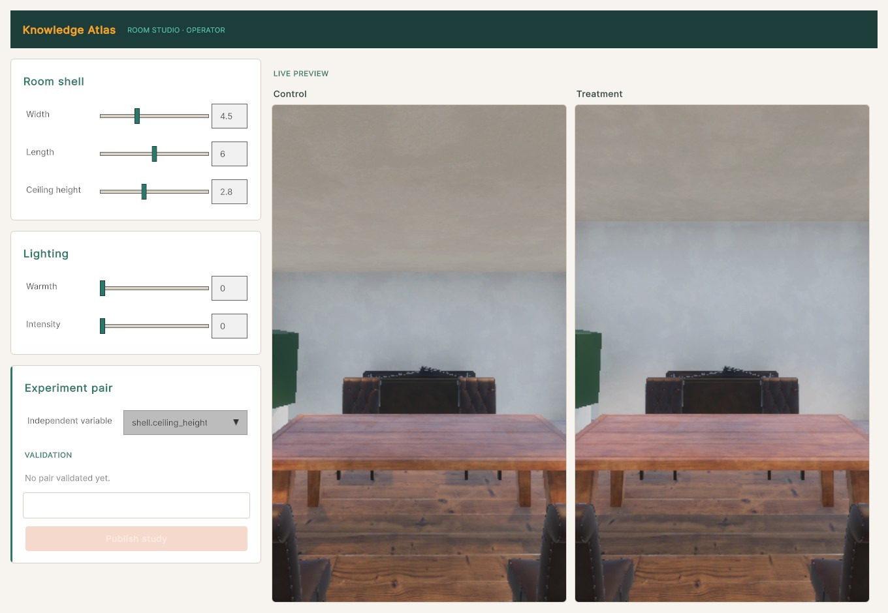

# Knowledge Atlas

**A research instrument for environmental neuroscience.** It lets a researcher author two rooms
that differ in *exactly one* declared variable, walk both in 3D, run a participant through them,
and collect clean response data.

COGS 160 Track 3 · UC San Diego · advised by Prof. David Kirsh.



## The problem this solves

Studies on how architecture affects people — does a higher ceiling change how you feel, does a
curved wall read as calmer — live or die on **stimulus control**. If the "high ceiling" room is also
slightly brighter, or has one more chair, the result is confounded and the finding is worthless.
Building matched room pairs by hand in a 3D tool is slow and the mistakes are invisible.

So the guarantee is the product. Every room is described by a single JSON contract, and a
control/treatment pair is **mechanically rejected** unless the two specs differ in precisely the
variables the researcher declared — nothing more, nothing less. A confounded pair cannot be
published to a participant.

```
AUTHOR              VALIDATE               GENERATE + RENDER          COLLECT
Unity slider UI  →  single-variable gate → Unity HDRP room build  →  responses → CSV
(live previews)     (declared vars only)   (desktop walk / VR)
```

The gate has a Python reference implementation, [`tools/validate_pair.py`](tools/validate_pair.py),
and every port must reproduce it against committed golden vectors
([`spec/fixtures/diff_vectors.json`](spec/fixtures/)). That is the project's load-bearing test.

## Run it

**Just want to see a study run?** Download the participant app — no Unity, no source.
See [docs/TEAM_RUN.md](docs/TEAM_RUN.md). *(Windows is verified. macOS currently has a known
packaging defect and is below its performance target — details in that doc.)*

**Working on it?** Full setup in [docs/GETTING_STARTED.md](docs/GETTING_STARTED.md). The short
version:

```powershell
# Contracts + the reference gate (Python)
python -m pip install -r requirements.txt
python -m pytest tests -q
python tools/validate_pair.py spec/pairs/ceiling_height_study_01/control.spec.json `
                              spec/pairs/ceiling_height_study_01/treatment.spec.json

# The app: Unity Hub → install exactly 6000.3.16f1 → open unity/ → wait for HDRP import
# → menu "RoomGen ▸ Bootstrap Project" → "RoomGen ▸ Fetch CC0 Materials" → Play.
```

A different Unity version will silently upgrade the project — 6000.3.16f1 exactly.

## Where things are

**Read first:** [PLAN.md](PLAN.md) (one-page plan) → [docs/WORKING_AGREEMENT.md](docs/WORKING_AGREEMENT.md) (who decides what) → [docs/ARCHITECTURE.md](docs/ARCHITECTURE.md)
(architecture of record, decision log) → [docs/CODE_MAP.md](docs/CODE_MAP.md) (**what boots, what
owns what, which surfaces are retiring** — read this before touching any UI).

| Path | What |
|---|---|
| [`unity/`](unity/) | The Unity 6000.3 + HDRP app: parametric generator, operator studio, participant runner. |
| [`spec/`](spec/) | The contracts. `room_spec.schema.json` (frozen v1), `study.schema.json`, `response_log.schema.json`, `contracts/` (engine seam, room API), `fixtures/` (golden vectors), `pairs/` (committed study pairs). |
| [`tools/validate_pair.py`](tools/validate_pair.py) | The single-variable gate — reference implementation. |
| [`tests/`](tests/) | Python contract tests. Unity tests live in `unity/Assets/RoomGen/Tests/`. |
| [`docs/`](docs/) | Architecture, code map, setup, performance targets, research notes, and `history/` for superseded plans. |
| [`handoffs/`](handoffs/) | Per-workstream execution briefs — see [handoffs/README.md](handoffs/README.md) for what's live vs archived. |
| [`team_hub/`](team_hub/) | The team's status site. |

## Status

| Milestone | State |
|---|---|
| Contract frozen (`room_spec.schema.json` v1) | Done |
| Pipeline proven end-to-end (author → gate → render → CSV) | Done |
| HDRP generator: curved walls, calibrated physical lighting, daylight model | Done |
| Operator studio + participant runner, released as a desktop app | Windows verified; macOS has open defects |
| Furniture placement (free X/Z, catalog) | In progress |
| VR live-editing (participant in headset, operator editing live) | Not started — the north star |

Current focus and dated roadmap: [PLAN.md](PLAN.md). Live status board:
[handoffs/COORDINATION.md](handoffs/COORDINATION.md).

## About the code

This is a student research project built with heavy AI assistance, and the commit history says so
openly — co-author trailers are left intact. The engineering standards that matter here are the ones
the science depends on: the single-variable gate has a reference implementation and golden vectors,
the participant-facing UI is kept free of anything that could cue a hypothesis, and claims about
visual output are verified by looking at renders rather than by green tests
([docs/CODE_MAP.md](docs/CODE_MAP.md) §4).

*Predecessor repo (retired): [`1michaelbongiorno/cogs160track3v2`](https://github.com/1michaelbongiorno/cogs160track3v2) —
a Blender/Infinigen generation pipeline with a web viewer. Retired because the generator's openings
were unfixable and its parameters weren't reachable; the salvage map is
[docs/LEGACY_PROJECT.md](docs/LEGACY_PROJECT.md).*
